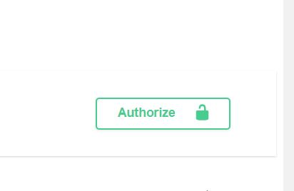

# fastapi_sqlalchemy_alembic

## Cd

    cd project

## How to build

    docker-compose build

## How to run

    docker-compose up

and go to:

    http://localhost:8000/docs
    First sign up
    Then login
    And add your access token in Authorize section (upper right corner) as Bearer <access_token>
    
    
      
    
